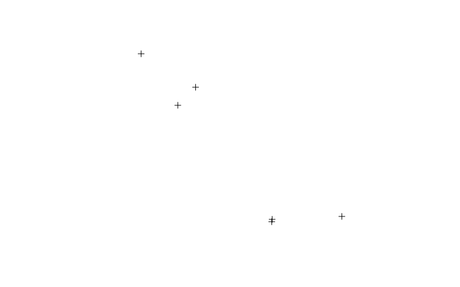
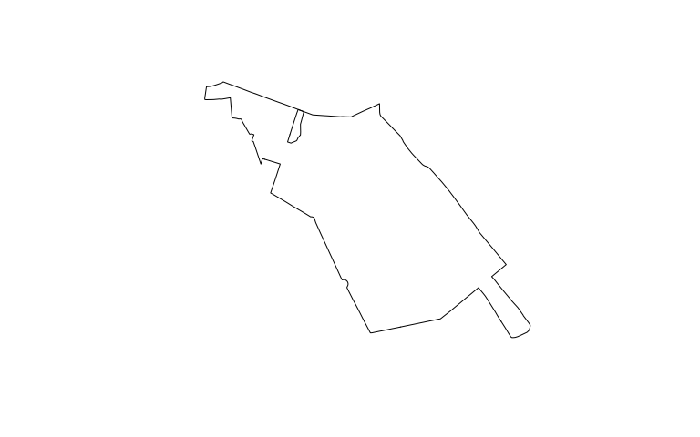
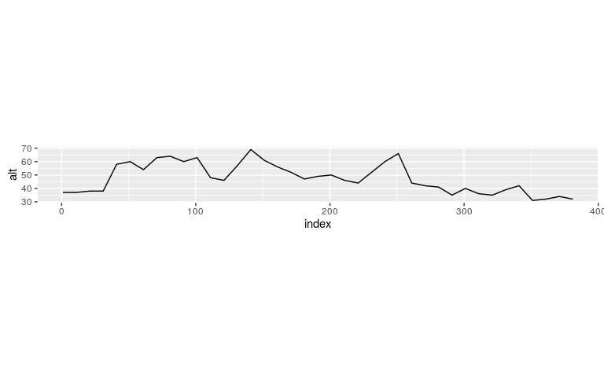
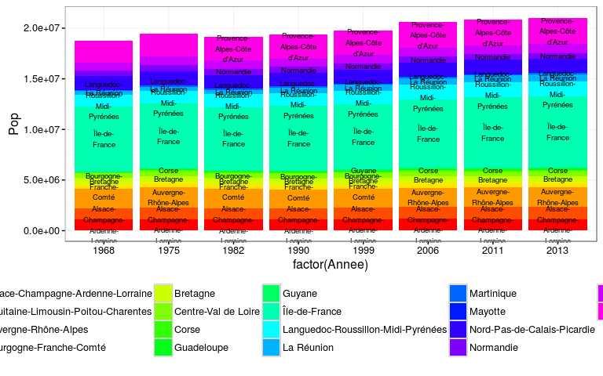
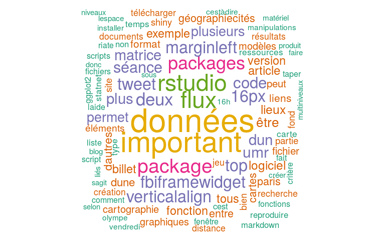

# Extraire des données depuis Internet
ElementR - Robin Cura  
`r paste('Vague 3', 'Séance 1', Sys.Date(), sep=' - ')`  


# Utiliser des *API* à travers des *packages* dédiés

## Géocoder une liste de lieux

### Requête de récupération


```r
library(dplyr)
library(photon)  # devtools::install_github(repo = 'rCarto/photon')


geogeoplaces <- data_frame(Nom = c("Institut de Géographie", "Géographie-cités", 
    "PRODIG", "Centre PMF", "Centre Montreal", "Olympe de Gouges"), Adresse = c("Institut de Géographie, 75005 Paris, France", 
    "Rue du Four, 75006 Paris, France", "Rue Valette, 75005 Paris, France", 
    "90 rue de Tolbiac, 75013 Paris, France", "105 rue de Tolbiac, 75013 Paris, France", 
    "Rue Albert Einstein, 75013 Paris, France"))

geoCodingResults <- tryCatch(geocode(geogeoplaces$Adresse, limit = 1, lang = "fr"), 
    error = function(e) readRDS("data/geoCodingResults.Rds"))
```

```
[1] "Institut de Géographie, 75005 Paris, France"
[1] "Rue du Four, 75006 Paris, France"
[1] "Rue Valette, 75005 Paris, France"
[1] "90 rue de Tolbiac, 75013 Paris, France"
[1] "105 rue de Tolbiac, 75013 Paris, France"
[1] "Rue Albert Einstein, 75013 Paris, France"
```

```r
geogeogeoplaces <- geogeoplaces %>% bind_cols(geoCodingResults %>% select(lat, 
    lon))
```

### Conversion en format R


```r
library(sp)
geogeogeoplaces <- as.data.frame(geogeogeoplaces, stringsAsFactors = FALSE)
coordinates(geogeogeoplaces) <- ~lon + lat
proj4string(geogeogeoplaces) <- CRS("+init=epsg:4326")
```

### Cartographie


```r
library(mapview)

plot(geogeogeoplaces)
```

<!-- -->

```r
tryCatch(mapView(geogeogeoplaces))
```

## Trouver le plus court chemin entre ces lieux

### Requête de récupération


```r
library(osrm)  # devtools::install_github('rCarto/osrm')

plusCourtItineraire <- tryCatch(osrmTripGeom(geogeogeoplaces, sp = TRUE), error = function(e) readRDS("data/plusCourtItineraire.Rds"))
```

### Conversion en format R


```r
geoitineraire <- plusCourtItineraire[[1]]
str(geoitineraire)
```

```
List of 2
 $ trip   :Formal class 'SpatialLinesDataFrame' [package "sp"] with 4 slots
  .. ..@ data       :'data.frame':	6 obs. of  1 variable:
  .. .. ..$ Name: chr [1:6] "6->4" "4->5" "5->1" "1->2" ...
  .. ..@ lines      :List of 6
  .. .. ..$ :Formal class 'Lines' [package "sp"] with 2 slots
  .. .. .. .. ..@ Lines:List of 1
  .. .. .. .. .. ..$ :Formal class 'Line' [package "sp"] with 1 slot
  .. .. .. .. .. .. .. ..@ coords: num [1:52, 1:2] 2.38 2.38 2.38 2.38 2.38 ...
  .. .. .. .. ..@ ID   : chr "6->4"
  .. .. ..$ :Formal class 'Lines' [package "sp"] with 2 slots
  .. .. .. .. ..@ Lines:List of 1
  .. .. .. .. .. ..$ :Formal class 'Line' [package "sp"] with 1 slot
  .. .. .. .. .. .. .. ..@ coords: num [1:2, 1:2] 2.36 2.36 48.83 48.83
  .. .. .. .. ..@ ID   : chr "4->5"
  .. .. ..$ :Formal class 'Lines' [package "sp"] with 2 slots
  .. .. .. .. ..@ Lines:List of 1
  .. .. .. .. .. ..$ :Formal class 'Line' [package "sp"] with 1 slot
  .. .. .. .. .. .. .. ..@ coords: num [1:86, 1:2] 2.36 2.36 2.36 2.36 2.36 ...
  .. .. .. .. ..@ ID   : chr "5->1"
  .. .. ..$ :Formal class 'Lines' [package "sp"] with 2 slots
  .. .. .. .. ..@ Lines:List of 1
  .. .. .. .. .. ..$ :Formal class 'Line' [package "sp"] with 1 slot
  .. .. .. .. .. .. .. ..@ coords: num [1:51, 1:2] 2.34 2.34 2.34 2.34 2.34 ...
  .. .. .. .. ..@ ID   : chr "1->2"
  .. .. ..$ :Formal class 'Lines' [package "sp"] with 2 slots
  .. .. .. .. ..@ Lines:List of 1
  .. .. .. .. .. ..$ :Formal class 'Line' [package "sp"] with 1 slot
  .. .. .. .. .. .. .. ..@ coords: num [1:63, 1:2] 2.33 2.33 2.33 2.34 2.34 ...
  .. .. .. .. ..@ ID   : chr "2->3"
  .. .. ..$ :Formal class 'Lines' [package "sp"] with 2 slots
  .. .. .. .. ..@ Lines:List of 1
  .. .. .. .. .. ..$ :Formal class 'Line' [package "sp"] with 1 slot
  .. .. .. .. .. .. .. ..@ coords: num [1:128, 1:2] 2.35 2.35 2.35 2.35 2.35 ...
  .. .. .. .. ..@ ID   : chr "3->6"
  .. ..@ bbox       : num [1:2, 1:2] 2.33 48.83 2.39 48.85
  .. .. ..- attr(*, "dimnames")=List of 2
  .. .. .. ..$ : chr [1:2] "x" "y"
  .. .. .. ..$ : chr [1:2] "min" "max"
  .. ..@ proj4string:Formal class 'CRS' [package "sp"] with 1 slot
  .. .. .. ..@ projargs: chr "+init=epsg:4326 +proj=longlat +datum=WGS84 +no_defs +ellps=WGS84 +towgs84=0,0,0"
 $ summary:List of 4
  ..$ startingPoint: chr "Rue Albert Einstein"
  ..$ endingPoint  : chr "Rue Albert Einstein"
  ..$ time         : num 19.9
  ..$ distance     : num 13.3
```

```r
geoitineraire$summary
```

```
$startingPoint
[1] "Rue Albert Einstein"

$endingPoint
[1] "Rue Albert Einstein"

$time
[1] 19.86667

$distance
[1] 13.348
```

### Cartographie


```r
plot(geoitineraire$trip)
```

<!-- -->

```r
tryCatch(mapView(geoitineraire$trip), error = function(e) plot(geoitineraire$trip))
```

## Créer un profil du trajet

### Segmenter le trajet


```r
library(magrittr)
coordsLists <- lapply(geoitineraire$trip@lines, function(x) {
    x@Lines[[1]]@coords
})
coordsDF <- lapply(coordsLists, function(x) {
    as.data.frame(x)
}) %>% rbind_all() %>% set_colnames(c("lon", "lat"))
```

### Récuperer l'altitude


```r
library(geonames)
coordsDF$index <- as.numeric(row.names(coordsDF))
altitudeDF <- coordsDF[seq(from = 1, to = nrow(coordsDF), by = 10), ]

tryCatch(options(geonamesUsername = "parisgeo"))

altitudePoints <- tryCatch(apply(altitudeDF, MARGIN = 1, FUN = function(x) {
    res <- GNsrtm3(lat = x["lat"], lng = x["lon"])
    res$srtm3
}), error = function(e) readRDS("data/altitudePoints.Rds"))

altitudeDF$alt <- altitudePoints
```

### Affichage du profil du trajet


```r
ggplot(altitudeDF, aes(x = index, y = alt)) + geom_line(group = 1) + coord_equal(ratio = 1)
```

<!-- -->


# Récuperer du contenu HTML formaté

## Récupération d'une page


```r
library(xml2)

rawWikipediaPage <- tryCatch(read_html(x = "https://fr.wikipedia.org/wiki/Liste_des_communes_de_France_les_plus_peupl%C3%A9es"), 
    error = function(e) readRDS("data/rawWikipediaPage.Rds"))
```

## Conversion en format R


```r
library(rvest)
library(magrittr)

rawWikiTable <- rawWikipediaPage %>% html_nodes(".wikitable") %>% extract2(1) %>% 
    html_table(trim = TRUE, dec = ",")
```

## Nettoyage


```r
library(stringr)

communesFr <- rawWikiTable

communesFr <- communesFr %>%
  set_colnames(
    gsub(x = colnames(.), pattern = "\\[[^\\]]*\\]", replacement = "", perl=TRUE) %>% # Suppression des [*]
    str_replace_all( string = ., pattern = "\\s", replacement = "") %>% # Suppression des espaces
    str_replace_all(string = ., pattern = fixed(","), replacement = "") %>% # Suppression des ","
    str_replace_all(string = ., pattern = fixed("é"), replacement = "e")
  ) %>%
  rename(Rank = `#o`)
```


```r
library(dplyr)

communesFr <- communesFr %>%
  mutate_each(funs(gsub(x = ., pattern = "\\[[^\\]]*\\]", replacement = "", perl=TRUE))) %>% # Suppression des [*]
  mutate_each(funs(str_replace_all(string = ., pattern = fixed(","), replacement = ""))) %>% # Suppression des ","
  mutate_each(funs(gsub(x = ., pattern = "\\([^\\]]*\\)", replacement = "", perl=TRUE))) %>% # Suppression des (*)
  mutate_each(funs(str_replace_all(string = ., pattern = fixed("+"), replacement = ""))) %>% # Suppression des "+"
  mutate_each(vars = -c(1:4), funs(str_replace_all( string = ., pattern = "\\s", replacement = ""))) %>% # Suppression des espaces
  mutate_each(vars = -c(1:4), funs(as.numeric)) # Conversion en numeric
```

## Utilisation


```r
library(tidyr)
library(ggplot2)

communesParRegion <- communesFr %>% group_by(Region) %>% summarise_each(funs(sum), 
    -c(1:4)) %>% gather(key = Annee, value = Pop, -Region) %>% group_by(Annee) %>% 
    mutate(label_y = cumsum(Pop) - 0.5 * Pop) %>% mutate(label_name = str_wrap(Region, 
    width = 12))

ggplot(communesParRegion, aes(factor(Annee), Pop, group = Region, fill = Region), 
    col = "black") + geom_bar(stat = "identity") + geom_text(aes(y = label_y, 
    label = label_name), col = "black", size = 2.5, check_overlap = TRUE) + 
    scale_fill_manual(values = rainbow(20)) + theme_bw() + theme(legend.position = "bottom")
```

<!-- -->

# Extraire et stucturer du contenu Web brut

## Récuperer l'ensemble des liens de billets d'un blog

### On récupère les liens vers le classement chronologique des billets


```r
home_page <- tryCatch(read_html("http://elementr.hypotheses.org/"), error = function(e) readRDS("data/home_page.Rds"))


home_links <- home_page %>% html_nodes("a") %>% html_attr("href")

reg_query1 <- "/date/"
dates_links <- home_links[grepl(home_links, pattern = reg_query1)]
```

### On parcours ces pages pour en extraire les articles


```r
posts_links <- character()

for (thisLink in dates_links) {
    this_page_links <- read_html(thisLink) %>% html_nodes("a") %>% html_attr("href")
    
    reg_query2 <- "http://elementr.hypotheses.org/\\d"
    
    this_page_posts_links <- this_page_links[grepl(this_page_links, pattern = reg_query2)]
    posts_links <- c(posts_links, this_page_posts_links)
}

if (length(posts_links) == 0) {
    posts_links <- readRDS("data/posts_links.Rds")
}
```

## Récuperer leur contenu

### Contenu brut


```r
posts_content <- character()

for (this_post in posts_links) {
    this_content <- read_html(this_post) %>% html_node("article .entry-content") %>% 
        html_text()
    posts_content <- c(posts_content, this_content)
}

if (length(posts_content) == 1) {
    posts_content <- readRDS("data/posts_links.Rds")
}
```

### Nettoyage


```r
library(tm.plugin.webmining)

clean_posts_content <- unlist(lapply(posts_content, extractHTMLStrip))
```


## L'analyser


```r
library(tm)
library(wordcloud)
library(RColorBrewer)

textCorpus <- Corpus(VectorSource(clean_posts_content)) %>% tm_map(content_transformer(tolower)) %>% 
    tm_map(removePunctuation) %>% tm_map(PlainTextDocument) %>% tm_map(removeWords, 
    stopwords("french")) %>% wordcloud(max.words = 100, random.order = FALSE, 
    random.color = FALSE, colors = brewer.pal(6, "Dark2"))
```

<!-- -->
