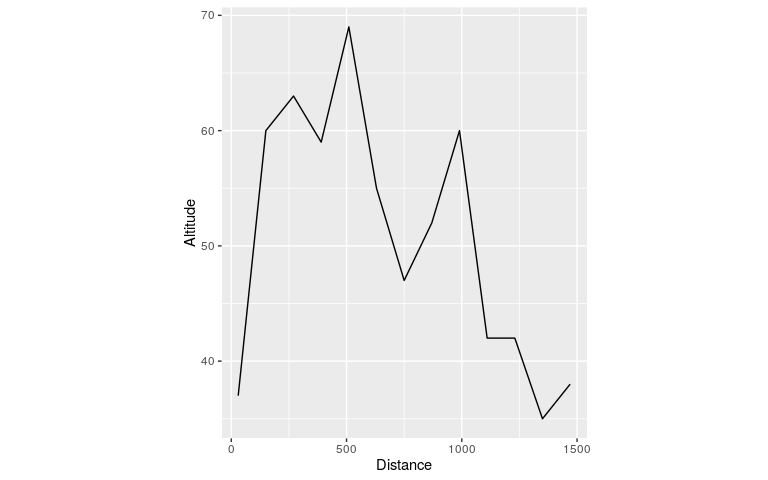

# Extraire des données depuis Internet<br />(1/3) - Utilisation d'API natives</h2>
Robin Cura  
ElementR, Vague 3, Séance 1 - 30/03/2016  


Ce tutoriel vise à donner un exemple d'utilisation d'*API*^[Une *API*, ou [Interface de Programmation](https://fr.wikipedia.org/wiki/Interface_de_programmation) est un service mis à disposition d'un public (complet ou restreint) lui permettant de récupérer du contenu (*web* ici) de manière automatique.] depuis **R**, autour d'un exercice complet qui consiste à préparer le parcours d'un événement scientifique inscrit dans un certain nombre de "lieux de la géographie" quantitative parisienne.
La démarche est composée de 3 étapes :  

  1. Doter les lieux choisis de coordonnées géographiques, c'est le **géocodage**,  

  2. Rechercher un trajet entre ces lieux, c'est une opération de **calcul d'itinéraire**,  

  3. Établir le profil altimétrique du trajet résultant afin de **contextualiser** l'itinéraire.
  
Chacune de ces étapes fait appel à une *API* [libre](https://fr.wikipedia.org/wiki/Licence_libre) différente, choisie pour être aussi simple que possible à utiliser. Il existe naturellement de nombreuses autres manières de parvenir aux mêmes résultats, la démarche choisit ici est donc uniquement illustrative et pédagogique. 

# Geocoder une liste de lieux

## Données sources

On crée un *data.frame* qui contient les lieux que l'on souhaite géocoder, *ie.* quelques lieux de la géographie parisienne.
On utilise ici le package `tibble` et sa fonction `data_frame()` plutôt que la fonction de base `data.frame()`. Les objets de type `data_frame` sont des *data.frame* améliorés, plus rapides, à la syntaxe moins verbeuse (plus besoin de faire appel aux sempiternels `stringsAsFactors = FALSE` etc.), et qui sont dotés d'un aperçu plus condensé et lisible. Ce format `data_frame` (ou `tbl_df`) a été apporté par le package `dplyr` et est extensivement utilisé dans l'ensemble des packages du *Hadleyverse*^[Ensemble des *packages* créés par Hadley Wickham, un développeur **R** prolifique qui a notamment créé `ggplot2`, `reshape2`, `(d)plyr`. En voir une [présentation complète](https://barryrowlingson.github.io/hadleyverse)]


```r
library(tibble)

geoplaces <- data_frame(Nom = c("Institut de Géographie",
                                   "Géographie-cités",
                                   "PRODIG",
                                   "Centre PMF",
                                   "Centre Montreal",
                                   "Olympe de Gouges"),  
                           
                           Adresse = c("Institut de Géographie, 75005 Paris, France",
                                      "Rue du Four, 75006 Paris, France",
                                      "Rue Valette, 75005 Paris, France",
                                      "90 rue de Tolbiac, 75013 Paris, France",
                                      "105 rue de Tolbiac, 75013 Paris, France",
                                      "Rue Albert Einstein, 75013 Paris, France")
                           )
```


## Récuperer les coordonnées via une API de géocodage

On utilise pour cette étape le package `photon`^[[En consulter la page de développement](https://github.com/rCarto/photon)], créé par Timothée Giraud et décrit sur [son blog](https://rgeomatic.hypotheses.org/622).
La fonction `geocode()` prend en entrée un vecteur des adresses et renvoie un *data.frame* contenant les adresses et coordonnées probables correspondant aux entrées. On choisit ici de limiter la sortie au meilleur résultat pour chaque adresse (paramètre `limit`), afin de pouvoir simplifier l'enrichissement des données initiales. Le paramètre `lang` définir la langue de l'adresse, et améliore ainsi la précision du géocodage.

**N.B.** :  La fonction `kable()` (*knit table*), du package `knitr` permet d'afficher un *data.frame*, dans un document *markdown* tel que celui-ci, de plus élégante manière qu'un simple `print()`.


```r
library(photon)  # devtools::install_github(repo = 'rCarto/photon')

geoCodingResults <- geocode(geoplaces$Adresse, limit = 1, lang = "fr")
```

```
[1] "Institut de Géographie, 75005 Paris, France"
[1] "Rue du Four, 75006 Paris, France"
[1] "Rue Valette, 75005 Paris, France"
[1] "90 rue de Tolbiac, 75013 Paris, France"
[1] "105 rue de Tolbiac, 75013 Paris, France"
[1] "Rue Albert Einstein, 75013 Paris, France"
```

```r
kable(geoCodingResults)
```


location                                      name                     housenumber   street                      postcode   city    state           country   osm_key   osm_value           lon        lat  msg 
--------------------------------------------  -----------------------  ------------  --------------------------  ---------  ------  --------------  --------  --------  ------------  ---------  ---------  ----
Institut de Géographie, 75005 Paris, France   Institut de Géographie   NA            Rue Pierre et Marie Curie   75005      Paris   Île-de-France   France    amenity   university     2.342589   48.84469  NA  
Rue du Four, 75006 Paris, France              Rue du Four              NA            NA                          75006      Paris   Île-de-France   France    highway   tertiary       2.333937   48.85270  NA  
Rue Valette, 75005 Paris, France              Rue Valette              NA            NA                          75005      Paris   Île-de-France   France    highway   residential    2.346782   48.84749  NA  
90 rue de Tolbiac, 75013 Paris, France        NA                       90            Rue de Tolbiac              75013      Paris   Île-de-France   France    place     house          2.364828   48.82695  NA  
105 rue de Tolbiac, 75013 Paris, France       NA                       105           Rue de Tolbiac              75013      Paris   Île-de-France   France    place     house          2.364743   48.82658  NA  
Rue Albert Einstein, 75013 Paris, France      Rue Albert Einstein      NA            NA                          75013      Paris   Île-de-France   France    highway   residential    2.381274   48.82741  NA  

## On enrichit le tableau initial

La fonction renvoie un nouveau *data.frame* contenant l'ensemble des informations liées au géocodage, ce qui permet d'évaluer la qualité de celui-ci et de vérifier que des erreurs n'ont pas été commises.
On ne gardera ici que les colonnes correspondant aux coordonnées (exprimées en latitudes et longitudes, donc en degrés inscrits dans le système WGS84^[Comme à peu près toutes les informations spatiales disponibles sur Internet.]).
On va alors pouvoir enrichir le tableau initial en lui concaténant ces deux nouvelles colonnes résultantes.
On isole les deux colonnes avec la fonction `select()` du package `dplyr`, et on les concatène au tableau initial avec `bind_cols()` issu du même package.


```r
library(dplyr)

geogeoplaces <- geoplaces %>% bind_cols(select(geoCodingResults, lat, lon))

kable(geogeoplaces)
```


Nom                      Adresse                                             lat        lon
-----------------------  --------------------------------------------  ---------  ---------
Institut de Géographie   Institut de Géographie, 75005 Paris, France    48.84469   2.342589
Géographie-cités         Rue du Four, 75006 Paris, France               48.85270   2.333937
PRODIG                   Rue Valette, 75005 Paris, France               48.84749   2.346782
Centre PMF               90 rue de Tolbiac, 75013 Paris, France         48.82695   2.364828
Centre Montreal          105 rue de Tolbiac, 75013 Paris, France        48.82658   2.364743
Olympe de Gouges         Rue Albert Einstein, 75013 Paris, France       48.82741   2.381274


## Conversion en format R

On a désormais un *data.frame* contenant les coordonnées, qu'il va falloir convertir dans un format spatial afin de pouvoir le cartographier. On réalise cette opération avec le package `sp`, qui va convertir le *data.frame* en objet `SpatialPointsDataFrame`, à partir des colonnes `lon` et `lat`, et lui associer le système de coordonnées géographique WGS 84^[Dont le code EPSG est 4326].


```r
library(sp)
geogeogeoplaces <- as.data.frame(geogeoplaces, stringsAsFactors = FALSE)
coordinates(geogeogeoplaces) <- ~lon + lat
proj4string(geogeogeoplaces) <- CRS("+init=epsg:4326")
```

## Cartographie statique

On peut alors afficher l'objet via la fonction `plot()`, ce qui donne une idée de la répartition des points, puis en faire une rapide carte statique avec le package `ggmap` et sa fonction éponyme, en allant chercher un fond de carte [OpenStreetMap](http://openstreetmap.org/) stylisé par [Stamen](http://maps.stamen.com/) avec `get_map()`.


```r
plot(geogeogeoplaces)
```

<!-- -->


```r
library(ggmap)
library(ggplot2)
baseMap <- get_map(location = geogeogeoplaces@bbox, source = "stamen", crop = FALSE, 
    maptype = "toner-lite")

ggmap(baseMap) + geom_point(data = geogeoplaces, aes(lon, lat), shape = 25, 
    fill = "blue", size = 3) + coord_map() + labs(x = "", y = "")
```

<!-- -->

## Cartographie dynamique

Afin de mener une exploration des données plus poussées, on peut faire appel à des outils de cartographie dynamiques, qui permettront par exemple de zoomer/dézoomer, ou encore de se déplacer pour la carte.
Pour un usage "rapide" et interactif, on peut utiliser la fonction `mapView()` du package `mapview`, qui se révèle très pratique mais ne permet pas une personnalisation très poussée.
Notons que cette fonction ne fonctionne pas dans le cadre de la création d'un document interactif tel que ce support, et que le résultat qu'elle produit n'est consultable que sur son propre ordinateur.


```r
library(mapview)

mapView(geogeogeoplaces)
```

Afin de mieux personnaliser la sortie, on utilise ici le package `leaflet`, qui permet de produire une carte via l'outil du même nom.


```r
library(leaflet)

leaflet(data = geogeogeoplaces) %>% 
addProviderTiles("CartoDB.Positron") %>% 
addMarkers(popup = ~as.character(Nom), icon = makeIcon("https://cdn2.iconfinder.com/data/icons/solar_system_png/512/Earth.png", 
    20, 20))
```

<!--html_preserve--><div id="htmlwidget-1485" style="width:768px;height:480px;" class="leaflet html-widget"></div>
<script type="application/json" data-for="htmlwidget-1485">{"x":{"calls":[{"method":"addProviderTiles","args":["CartoDB.Positron",null,null,{"errorTileUrl":"","noWrap":false,"zIndex":null,"unloadInvisibleTiles":null,"updateWhenIdle":null,"detectRetina":false,"reuseTiles":false}]},{"method":"addMarkers","args":[[48.84468875,48.8526958,48.8474916,48.8269527,48.8265807,48.8274057],[2.34258870987536,2.3339373,2.3467818,2.3648285,2.3647428,2.3812738],{"iconUrl":{"data":"https://cdn2.iconfinder.com/data/icons/solar_system_png/512/Earth.png","index":0},"iconRetinaUrl":{"data":20,"index":0},"iconWidth":20},null,null,{"clickable":true,"draggable":false,"keyboard":true,"title":"","alt":"","zIndexOffset":0,"opacity":1,"riseOnHover":false,"riseOffset":250},["Institut de Géographie","Géographie-cités","PRODIG","Centre PMF","Centre Montreal","Olympe de Gouges"],null,null]}],"limits":{"lat":[48.8265807,48.8526958],"lng":[2.3339373,2.3812738]}},"evals":[],"jsHooks":[]}</script><!--/html_preserve-->

**N.B.** :  Les syntaxes faisant appel aux *pipes* (tubes, `%>%` ici) sont de plus en plus fréquentes en R, en particulier avec l'utilisation de plus en plus courante de `dplyr`. Cet opérateur a été en premier lieu apporté par le package `magrittr`, et sa logique est de prendre en entrée l'argument qui le précède et de le fournir à la fonction qui suit. `mean(scale(runif(n = 5)))` est ainsi exprimé en `runif(n = 5) %>% scale() %>% mean()`, que l'on écrira le plus souvent sous la forme :
```
runif(n = 5) %>%
  scale() %>%
  mean()
```

Ce format rend la chaîne de traitement plus lisible, mieux documentable (on peut décrire sur chaque ligne ce qui est réalisé), et lui donne un mode de syntaxe fonctionnel. 

# Trouver le plus court chemin entre ces lieux

A partir de ce jeu de données spatialisées, nous allons maintenant chercher à trouver un itinéraire optimal entre tous ces points. Cette démarche fait appel au [problème du voyageur de commerce](https://fr.wikipedia.org/wiki/Probl%C3%A8me_du_voyageur_de_commerce), c'est-à-dire qu'on cherche l'itinéraire qui desserve chacun des points et revienne au point de départ tout en minimisant la distance parcourue. Il existe des outils permettant d'effectuer ce calcul depuis R, via des approximations successives concourant vers un optimum, mais on a ici choisi d'utiliser un service dédié, via l'*API* d'[OSRM](http://project-osrm.org/). Ce service de calcul d'itinéraire se base sur les données OpenStreetMap et permet d'en retirer des itinéraires précis susceptibles de répondre à différentes contraintes (itinéraires cyclistes, piétons etc.).

## Requête de récupération

Afin de faire appel à l'*API* d'OSRM, on utilisera le package `osrm`^[Lui aussi développé par Timothée Giraud], qui permet notamment de récupérer un objet directement interprétable par R plutôt qu'une longue de chaîne de caractères qu'il faudrait alors interpréter.
La fonction `osrmTrip()` renvoie une liste des composantes connexes (segments non reliés) de l'itinéraire.


```r
library(osrm)  # devtools::install_github('rCarto/osrm')

bestRoute <- osrmTrip(geogeogeoplaces)
```

## Conversion en format R

Ce trajet ne contient qu'une composante connexe, on peut donc en récupérer le premier objet^[Via l'utilisation des doubles crochets -- `[[`], qui contient lui-même deux objets : 

 * `trip`, de type `SpatialLinesDataFrame`, contenant les segments géométriques de l'itinéraire.
 * `summary` qui contient des informations générales sur l'itinéraire (durée et longueur totale).


```r
geoRoute <- bestRoute[[1]]

summary(geoRoute$trip)
```

```
Object of class SpatialLinesDataFrame
Coordinates:
        min       max
x  2.332898  2.382103
y 48.826160 48.853168
Is projected: FALSE 
proj4string :
[+init=epsg:4326 +proj=longlat +datum=WGS84 +no_defs +ellps=WGS84
+towgs84=0,0,0]
Data attributes:
 start end      duration          distance     
 1:1   1:1   Min.   :0.02667   Min.   :0.0151  
 2:1   2:1   1st Qu.:2.60500   1st Qu.:1.5700  
 3:1   3:1   Median :2.68417   Median :1.6134  
 4:1   4:1   Mean   :3.19528   Mean   :2.1054  
 5:1   5:1   3rd Qu.:4.23083   3rd Qu.:2.7231  
 6:1   6:1   Max.   :6.45167   Max.   :4.7421  
```

```r
geoRoute$summary
```

```
$duration
[1] 19.17167

$distance
[1] 12.6326
```

## Cartographie

On peut alors cartographier l'itinéraire résultant, comme dans l'étape précédente.


```r
plot(geoRoute$trip)
```

<!-- -->

Et cartographier l'ensemble des éléments spatiaux récupérés jusque là, toujours avec les mêmes fonctions.


```r
mapView(geoRoute$trip)

leaflet(data = geoRoute$trip) %>% 
addProviderTiles("CartoDB.Positron") %>% 
addPolylines(popup = ~sprintf("Distance : %s\nDurée :  %s", distance, duration)) %>% 
    
addMarkers(data = geogeogeoplaces, popup = ~as.character(Nom), icon = makeIcon("https://cdn2.iconfinder.com/data/icons/solar_system_png/512/Earth.png", 
    20, 20))
```

<!--html_preserve--><div id="htmlwidget-3036" style="width:768px;height:480px;" class="leaflet html-widget"></div>
<script type="application/json" data-for="htmlwidget-3036">{"x":{"calls":[{"method":"addProviderTiles","args":["CartoDB.Positron",null,null,{"errorTileUrl":"","noWrap":false,"zIndex":null,"unloadInvisibleTiles":null,"updateWhenIdle":null,"detectRetina":false,"reuseTiles":false}]},{"method":"addPolylines","args":[[[{"lng":[2.381261,2.37757,2.371365,2.364882],"lat":[48.827416,48.831025,48.827672,48.826799]}],[{"lng":[2.364882,2.36468],"lat":[48.826799,48.82677]}],[{"lng":[2.36468,2.359926,2.356091,2.356221,2.355108,2.350745,2.34363,2.345204,2.342662],"lat":[48.82677,48.82616,48.831037,48.831626,48.832123,48.83855,48.841219,48.844336,48.844847]}],[{"lng":[2.342662,2.342324,2.342049,2.340558,2.340921,2.340222,2.338816,2.337335,2.337056,2.332898,2.333165,2.333941],"lat":[48.844847,48.844915,48.844331,48.846816,48.847485,48.84754,48.849166,48.849294,48.851464,48.851271,48.852647,48.852695]}],[{"lng":[2.333941,2.335894,2.345541,2.344871,2.348511,2.348506,2.348129,2.346784],"lat":[48.852695,48.853168,48.850838,48.849591,48.848614,48.847448,48.84717,48.847498]}],[{"lng":[2.346784,2.348136,2.350519,2.356792,2.361423,2.361641,2.364783,2.366974,2.368454,2.369616,2.371597,2.377749,2.382103,2.37757,2.381261],"lat":[48.847498,48.850199,48.849618,48.849401,48.850819,48.849486,48.847369,48.845282,48.844266,48.843855,48.842398,48.836947,48.833512,48.831025,48.827416]}]],null,null,{"lineCap":null,"lineJoin":null,"clickable":true,"pointerEvents":null,"className":"","stroke":true,"color":"#03F","weight":5,"opacity":0.5,"fill":false,"fillColor":"#03F","fillOpacity":0.2,"dashArray":null,"smoothFactor":1,"noClip":false},["Distance : 1.5571\nDurée :  2.61","Distance : 0.0151\nDurée :  0.0266666666666667","Distance : 3.0915\nDurée :  4.72166666666667","Distance : 1.6089\nDurée :  2.75833333333333","Distance : 1.6178\nDurée :  2.60333333333333","Distance : 4.7421\nDurée :  6.45166666666667"]]},{"method":"addMarkers","args":[[48.84468875,48.8526958,48.8474916,48.8269527,48.8265807,48.8274057],[2.34258870987536,2.3339373,2.3467818,2.3648285,2.3647428,2.3812738],{"iconUrl":{"data":"https://cdn2.iconfinder.com/data/icons/solar_system_png/512/Earth.png","index":0},"iconRetinaUrl":{"data":20,"index":0},"iconWidth":20},null,null,{"clickable":true,"draggable":false,"keyboard":true,"title":"","alt":"","zIndexOffset":0,"opacity":1,"riseOnHover":false,"riseOffset":250},["Institut de Géographie","Géographie-cités","PRODIG","Centre PMF","Centre Montreal","Olympe de Gouges"],null,null]}],"limits":{"lat":[48.82616,48.853168],"lng":[2.332898,2.382103]}},"evals":[],"jsHooks":[]}</script><!--/html_preserve-->


# Créer un profil du trajet

Nous cherchons maintenant à enrichir cette information d'itinéraire, en prenant l'exemple de l'ajout d'un profil altimétrique, que l'on pourra afficher à côté de la carte.
Pour récupérer cette information sur l'altitude du trajet, on va utiliser l'*API* de [Geonames](http://www.geonames.org/), qui s'appuie notamment sur les données du [SRTM](http://www.geonames.org/export/web-services.html#srtm3 "Shuttle Radar Topography Mission") afin de communiquer l'élévation d'un point donné. Cette *API* est accessible dans R via le package `geonames`.

## Segmenter le trajet

L'*API* renvoie l'élévation d'un point, alors que notre itinéraire est sous format linéaire. Il va donc falloir segmenter la polyligne afin d'obtenir les nœuds (points) qui la composent.
Pour cela, on crée une fonction personnalisée qui va récupérer les coordonnées des nœuds composants les objets `Lines`, eux-mêmes contenus dans des `lines`^[La manière dont sont structurés les objets spatiaux de `sp` n'est de toute évidence pas la plus évidente et simple à comprendre.].
On obtient en sortie un *data.frame* contenant les longitudes et latitudes de chacun des nœuds des polylignes.


```r
library(magrittr)
coordsLists <- lapply(geoRoute$trip@lines, function(x) {
    x@Lines[[1]]@coords
})
coordsDF <- lapply(coordsLists, function(x) {
    as.data.frame(x)
}) %>% rbind_all() %>% set_colnames(c("lon", "lat"))

str(coordsDF)
```

```
Classes 'tbl_df', 'tbl' and 'data.frame':	50 obs. of  2 variables:
 $ lon: num  2.38 2.38 2.37 2.36 2.36 ...
 $ lat: num  48.8 48.8 48.8 48.8 48.8 ...
```

## Échantilloner les points

La base de données du SRTM est principalement constituée d'un [MNT](https://fr.wikipedia.org/wiki/Mod%C3%A8le_num%C3%A9rique_de_terrain "Modèle Numérique de Terrain") dont la résolution est d'environ 90 mètres. Rien ne sert donc de chercher à récuperer l'altitude de points qui seraient plus proches que cette distance. En considérant qu'on dispose de environ 400 points pour un trajet de 12 km, soit un point tous les 30 mètres en moyenne, on va échantilloner tous les 4 points.


```r
coordsDF$index <- as.numeric(row.names(coordsDF))
indexesToQuery <- seq(from = 1, to = nrow(coordsDF), by = 4)
altitudeDF <- coordsDF[seq(from = 1, to = nrow(coordsDF), by = 4), ]
```

## Récuperer l'altitude

On peut alors lancer la récupération des élévations, grace à l'appel de la fonction `GNsrtm3()` du package `geonames`. Cette fonction prend en entrée la latitude et la longitude du point dont on souhaite l'altitude, il va donc falloir l'appliquer à chacun des points, par l'utilisation de la fonction `apply`.
La fonction renvoie un *data.frame* constitué des coordonnées et de l'élévation (colonne `srtm3`, en mètres), que l'on va donc isoler et l'ajouter au *data.frame* utilisé pour l'appel.


```r
library(geonames)
options(geonamesUsername = "parisgeo")  # L'utilisation d'un compte utilisateur est nécessaire pour utiliser cette API.

altitudePoints <- apply(altitudeDF, MARGIN = 1, FUN = function(x) {
    res <- GNsrtm3(lat = x["lat"], lng = x["lon"])
    res$srtm3
})

altitudeDF$alt <- altitudePoints

str(altitudeDF)
```

```
Classes 'tbl_df', 'tbl' and 'data.frame':	13 obs. of  4 variables:
 $ lon  : num  2.38 2.36 2.36 2.34 2.34 ...
 $ lat  : num  48.8 48.8 48.8 48.8 48.8 ...
 $ index: num  1 5 9 13 17 21 25 29 33 37 ...
 $ alt  : num  37 60 63 59 69 55 47 52 60 42 ...
```

## Affichage du profil du trajet

On peut maintenant afficher le profil altimétrique via un graphique `ggplot`.


```r
library(ggplot2)
ggplot(altitudeDF, aes(x = index * 30, y = alt)) + geom_line(group = 1) + coord_equal(ratio = 50) + 
    labs(x = "Distance", y = "Altitude")
```

<!-- -->


L'ensemble du code de ce tutoriel est disponible sur le dépôt Git de cette séance du groupe [ElementR](http://elementr.hypotheses.org/) : [https://github.com/Groupe-ElementR/web-scraping](https://github.com/Groupe-ElementR/web-scraping)
